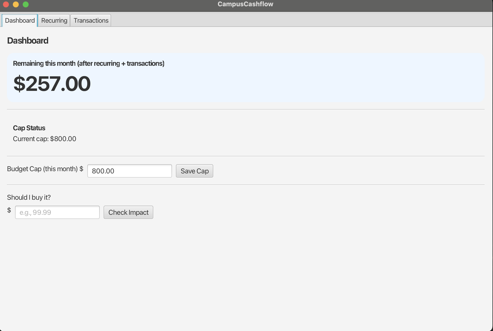
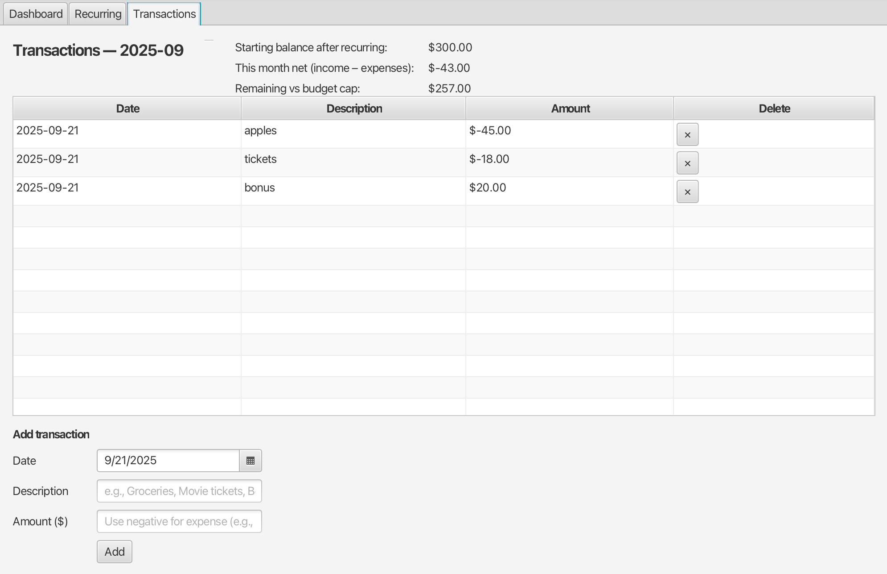
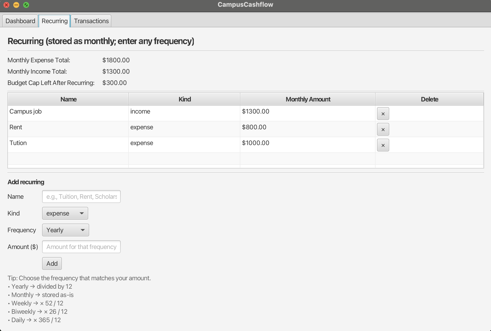

# 💸 CampusCashflow — Smart Budgeting for Students and Everyday Users  

> A minimal, all-in-one desktop finance tracker built for clarity, speed, and simplicity.  
> Designed and developed by [**Yash Kunal Mehta**](https://github.com/Yash-Mehtaa) — Computer Science & Finance student at Rutgers University–New Brunswick.

---

## 🌍 Story  

Moving to a new country is exciting — but managing monthly expenses can quickly become overwhelming. Between tuition, rent, groceries, and weekend plans, I kept asking the same question: **“Can I actually afford this?”**  

That frustration sparked **CampusCashflow** — a lightweight JavaFX desktop app that turns your entire budget into one clean, real-time number: *your remaining balance for the month.*  

The app started as a small student budgeting tool and evolved into a general-purpose finance manager that’s now simple enough for students yet robust enough for professionals.

---

## 🚀 Core Features  
✅ Live “Remaining Balance” overview  
✅ Add, edit, and delete one-time or recurring transactions  
✅ Automatic monthly rollover of data  
✅ Category-wise transaction tracking and charts  
✅ Offline-first design — uses local **SQLite** database (no cloud or login)  
✅ Platform: runs on macOS Apple Silicon 

---

## 🖼️ Screenshots  

| Dashboard View | Transaction Log | Recurring Payments |
|-----------------|-----------------|--------------------|
|  |  |  |

> 📸 These screenshots show the JavaFX interface in action — responsive, minimal, and fast.  

---

## 🧠 Built With  
- **Java 17** — core application logic  
- **JavaFX 25** — modern GUI toolkit  
- **SQLite** — embedded local database  
- **SLF4J** — lightweight logging  
- **Gradle / jpackage** — build automation and native packaging  

---

## 📦 Releases  

Each `.dmg` is built with all dependencies bundled — just drag it into **Applications** and start using.  
This version is **fully compatible with Apple Silicon (M-series Macs)**.

If you get a macOS warning that the app is **“not recognized”** or **“can’t be opened because it’s from an unidentified developer”**, follow these quick steps:  

> **System Settings → Privacy & Security → scroll all the way down → click “Open Anyway.”**  
✅ After that, it will launch normally every time.

---

⭐ **Thank you for reading and supporting CampusCashflow!**

---

## 🧭 Project Structure  

```plaintext
campuscashflow/
 ├── src/com/yash/campuscashflow/
 │     ├── AppBus.java
 │     ├── DashboardView.java
 │     ├── TransactionsView.java
 │     ├── RecurringView.java
 │     ├── Db.java
 │     ├── BudgetDao.java
 │     └── schema.sql
 ├── campus.db
 ├── run.sh
 ├── CampusCashflow.jar
 └── screenshots/
💡 Inspiration

```

Finance shouldn’t feel intimidating.
CampusCashflow focuses on clarity over complexity — showing just what you need to know right now, without graphs that make you feel guilty for buying coffee.

👨‍💻 Author

Yash Kunal Mehta
�� Rutgers University–New Brunswick
💼 Building projects at the intersection of Computer Science × Finance
🔗 GitHub
 • LinkedIn

⭐ Thank you for supporting CampusCashflow!
If you found it helpful, consider starring the repo — it helps others discover it too.
