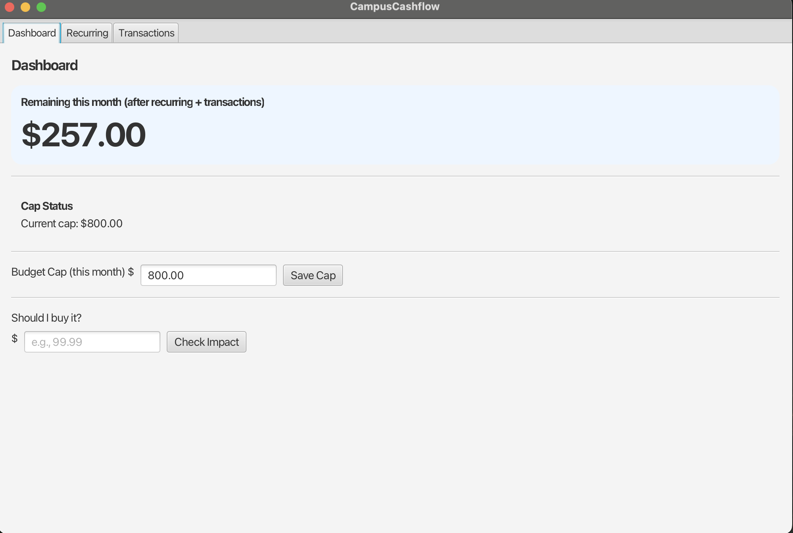
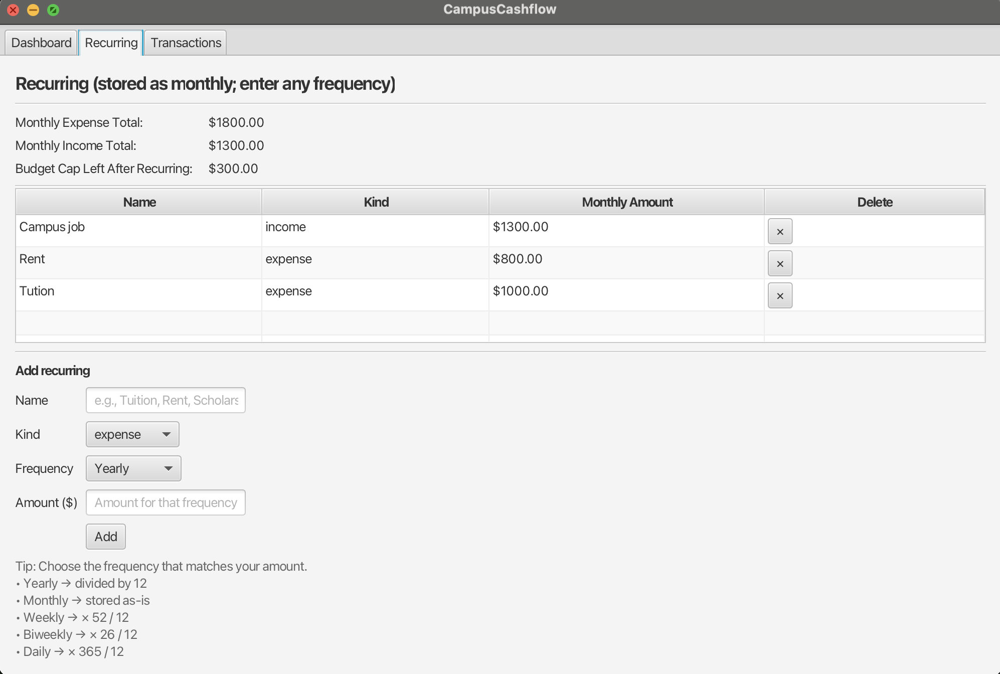
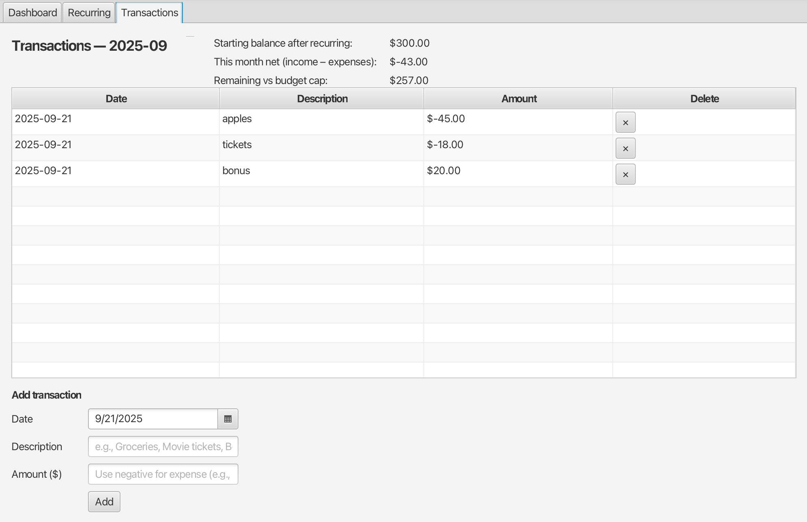

# CampusCashflow — Budget & “Can I Buy It?” Desktop App

> Moving to a new country is exciting, but as an international student in the U.S. I quickly learned that managing money each month was harder than I imagined. Tuition bills, rent, groceries, weekend plans, everything came at once, and knowing how much I could safely spend was a constant guessing game. Talking with friends showed me I wasn’t alone, most students were juggling spreadsheets, bank apps, and mental math just to figure out their balance.  
>
> That inspired me to build **CampusCashflow**, a clear and lightweight desktop app that turns messy finances into one live number: how much you actually have left this month. I started with a simple student budget tool and, step by step, kept refining the design and interface until it became something anyone can use. Today it is just as helpful for working adults as it is for students, making personal finance approachable for anyone who wants clarity and confidence with their money.

---

## ✨ Features

CampusCashflow helps you:

- Set a monthly **Budget Cap**  
- Add **recurring expenses and income** (tuition, rent, jobs, scholarships) with yearly, monthly, weekly, biweekly or daily frequency (auto-converted to monthly)  
- Log **daily transactions** and instantly see how they affect your balance  
- See a large, live number — “Remaining this month” — update as you add or delete data  
- Use a **“Should I buy it?”** field to test purchases against your remaining balance

---

## 📦 Project Structure

campuscashflow/
├─ settings.gradle

├─ gradlew

├─ gradlew.bat

├─ gradle/

│  └─ wrapper/

│     ├─ gradle-wrapper.jar

│     └─ gradle-wrapper.properties

└─ app/

   ├─ build.gradle
   
   └─ src/main/
   
      ├─ resources/
      
      │  └─ schema.sql
      
      └─ java/com/yash/campuscashflow/
      
         ├─ Main.java
         
         ├─ DashboardView.java
         
         ├─ RecurringView.java
         
         ├─ TransactionsView.java
         
         ├─ Db.java
         
         ├─ BudgetDao.java
         
         ├─ RecurringDao.java
         
         ├─ TxDao.java
         
         ├─ Money.java
         
         └─ AppBus.java


When you first run the app, a local SQLite file named **`campus.db`** is created automatically.

---

## 🚀 Quickstart

### Requirements
- Java 21 (Temurin, Oracle or OpenJDK)  
- macOS, Windows or Linux  
- Internet is needed only for the first Gradle build

### Build and Run

```bash
# from the project root
./gradlew :app:run       # macOS / Linux
# Windows:
gradlew.bat :app:run

1.Open the Dashboard and set a budget cap (e.g., 1000).

2.Go to Recurring and add Tuition (Yearly 12000), Rent (Monthly 800), Campus Job (Weekly 200).

3.Open Transactions and add groceries -45.50, movie -18, side gig +60.

4.Watch the Remaining this month figure update instantly.

Package as a local app (optional)
./gradlew :app:installDist


Run the executable from:
app/build/install/app/bin
```





🧮 How the calculation works

Every month the app computes:

Remaining =
  BudgetCap
  − TotalRecurringExpenses
  + TotalRecurringIncome
  + (IncomeFromTransactions − ExpensesFromTransactions)


Amounts

Positive = income

Negative = expense

Frequency conversion to monthly

Yearly ÷ 12

Monthly × 1

Weekly × 52 ÷ 12

Biweekly × 26 ÷ 12

Daily × 365 ÷ 12


🛠️ Troubleshooting

If you see an error about JavaFX modules, always run via Gradle: ./gradlew :app:run.

If you get a schema error about “transaction”, make sure your schema.sql uses the tx table name.

If the dashboard number doesn’t refresh, check that AppBus.notifyDataChanged() is called after edits.


🧱 Tech Stack

Java 21 • JavaFX • SQLite (sqlite-jdbc) • Gradle


Thanks for reading!

